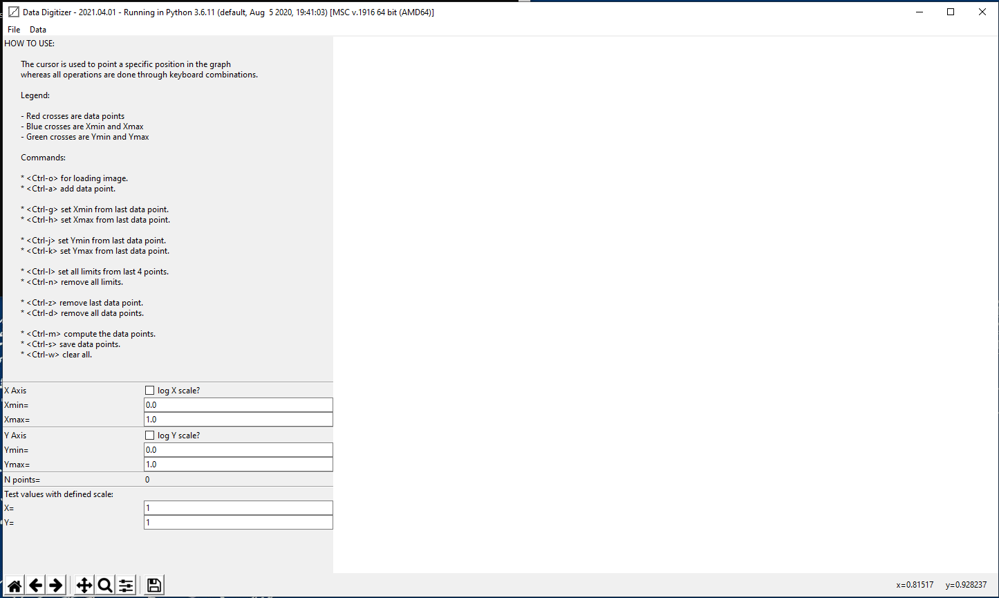
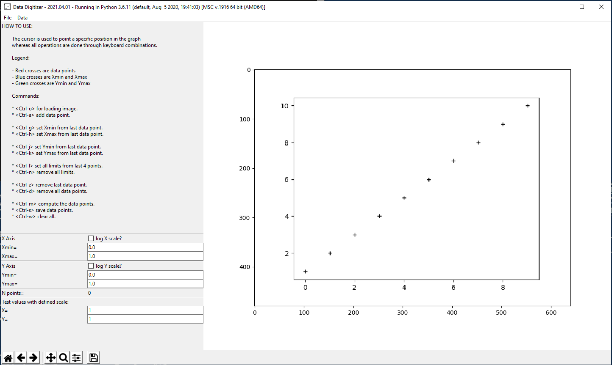
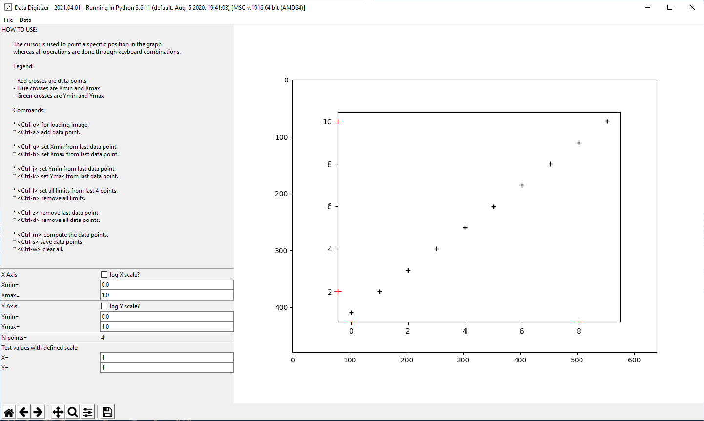
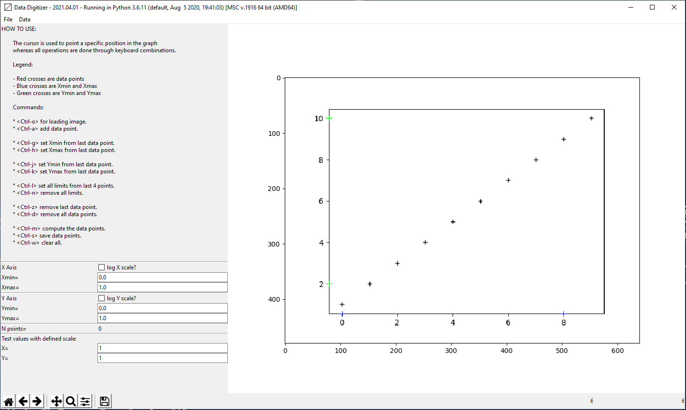
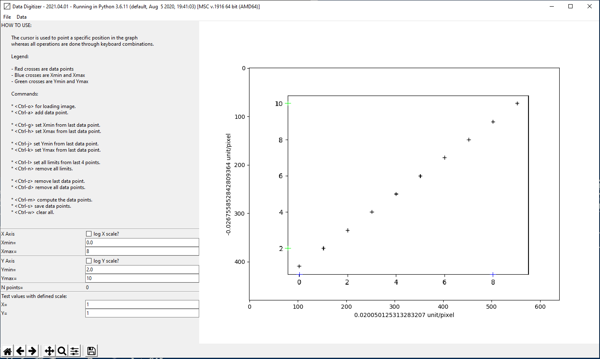
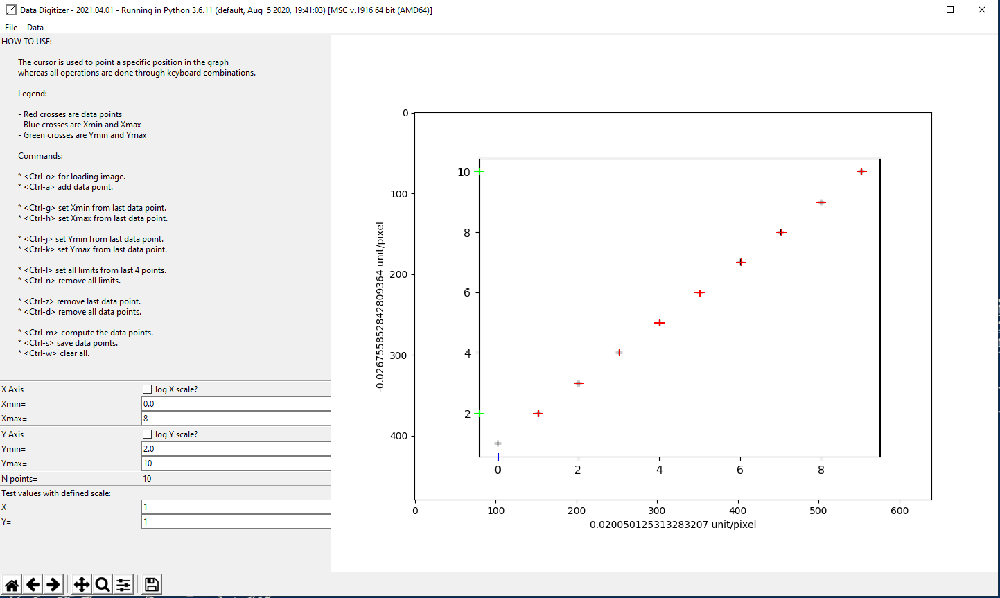
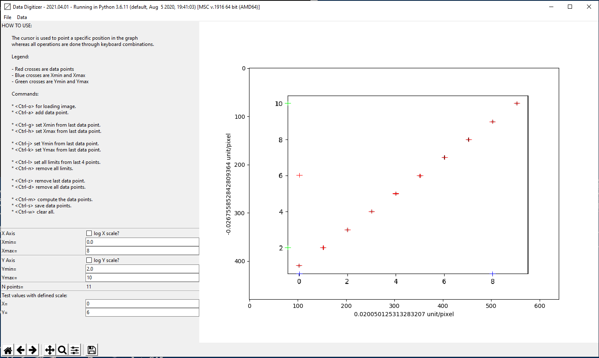

Open the app
================

Start the application by entering in the terminal:

.. code-block:: bash

    python -m digitizer

The main windows looks like in figure :ref:`main_window_figure`

.. _main_window_figure:

    Main Window

Open the image
================
Open an image from which you want to extract data by pressing <Ctrl-o>. Browse to the image and click OK.

.. _open_image_figure:

    Open graphic from which to extract data

Position XY Limits
=====================
Position 4 crosses for the axis limits in the order Xmin, Xmax, Ymin, Ymax by pointing them with the mouse
and adding them by clicking <Ctrl-a>.

.. _position_axis_figure:

    Open graphic from which to extract data

Set XY Limits
=====================
Press in the order <Ctrl-k>, <Ctrl-j>, <Ctrl-h>, <Ctrl-g>. It will set the Ymax, Ymin, Xmax and Xmin from
the last data point, respectively.
 * When <Ctrl-k> is pressed The last of the 4 red crosses will become the Ymax value and will colored in blue.
 * When <Ctrl-j> is pressed The last of the 3 red crosses will become the Ymin value and will colored in blue.
 * When <Ctrl-h> is pressed The last of the 2 red crosses will become the Xmax value and will colored in green.
 * When <Ctrl-k> is pressed The last red crosse will become the Xmin value and will colored in green.

You can set the XY limits in the different order if needed.

You can also set all the limits at once from the last 4 data points (red crosses) by pressing <Ctrl-l>.

The limits can be deleted by pressing <Ctrl-n>.

.. _set_xylimits_figure:

    Set XY limits

Enter XY Limits
=====================
Enter the corresponding value for Xmax, Xmin, Ymin and Ymax and press <Enter>. Switch to log scales if needed.

.. _set_xyvalues_figure:

    Set XY values

Add Data Points
=====================
Add data points by pointing them with the mouse and adding them by clicking <Ctrl-a>.
Once a data point is added you can adjust its position by pressing left, right, up and down arrows.
Press <Ctrl-m> to compute the data with the definded XY scales. Press <Ctrl-s> to save data.

.. _set_datavalues_figure:

    Set data values

Test Scale Values
====================
It is also possible de test the X/Y scales by entering values, e.g. X=0 and Y=6,
to ckeck if the scales are properly set.

.. _test_scalevalues_figure:

    Set data values